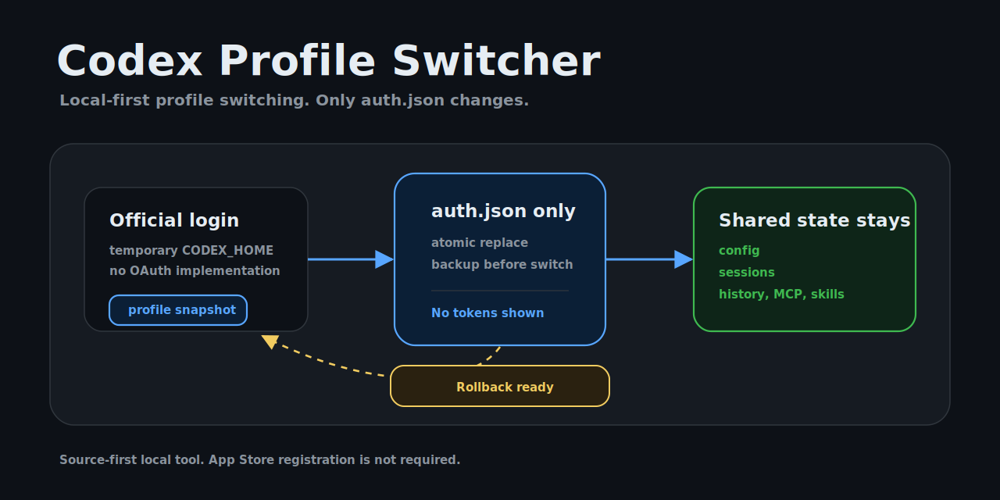
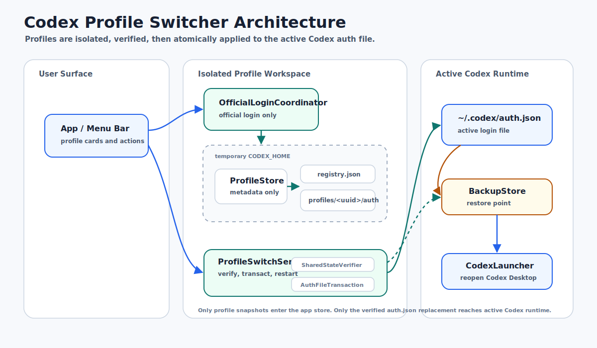
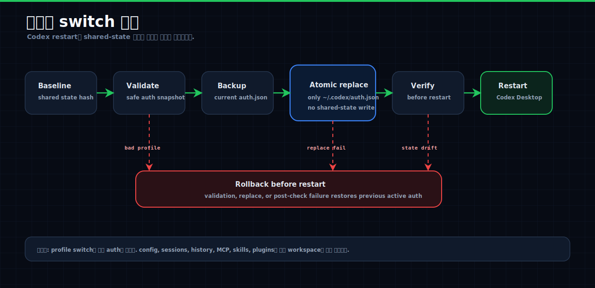
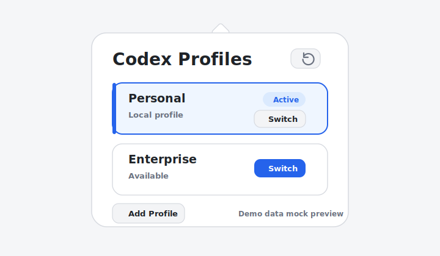

# Codex Profile Switcher

<p align="center">
  
</p>

Codex Desktop 계정을 로컬에서 안전하게 전환하기 위한 macOS menu-bar 앱입니다.

목표는 단순합니다.

- 계정만 바뀐다.
- `~/.codex/auth.json`만 교체한다.
- 기존 Codex config, sessions, history, MCP, skills, plugins는 그대로 공유한다.
- usage meter, reset credit, auto-switch, update check, config writer는 넣지 않는다.

이 앱은 팀 공용 계정 관리자나 서버형 계정 관리 도구가 아닙니다. 각 팀원이 자기 Mac에서 개인 계정과 엔터프라이즈 계정을 전환하기 위한 로컬 도구입니다.

## Reference

이 프로젝트는 [`lordydord/Codex-Account-Switcher`](https://github.com/lordydord/Codex-Account-Switcher)를 명시적으로 참고했습니다.

참고한 부분:

- macOS menu-bar 앱 형태
- account card 중심의 패널 UI
- active/inactive 계정을 빠르게 구분하는 UX
- Codex Desktop 재시작을 switch 흐름에 포함하는 방향

그대로 가져오지 않은 부분:

- `codex-auth` 의존성
- usage meter
- reset-credit 조회/사용
- API token mode
- auto-switch / auto-resume
- update check
- Codex config 수정/복구 기능

레퍼런스 repo는 MIT 라이선스입니다. 이 프로젝트는 해당 repo를 UI/UX reference로 삼았고, runtime core는 새로 작성했습니다.

## 왜 새로 만들었나

레퍼런스 repo는 `codex-auth`를 설치하고, `codex-auth login`, `codex-auth switch <email-query>` 흐름으로 계정을 전환합니다. 또한 usage, reset credit, auto-switch, health check, update check 같은 기능도 포함합니다.

우리가 필요한 것은 그보다 좁습니다.

- 개인 계정과 엔터프라이즈 계정을 번갈아 쓴다.
- 모든 Codex 세션/히스토리/MCP/skill/config는 동일하게 유지한다.
- 오직 active login만 바뀌어야 한다.
- 외부 helper나 계정별 usage API에 의존하지 않는다.
- token 처리 범위를 `auth.json` snapshot 교체로 제한한다.

그래서 이 repo는 visual pattern만 참고하고, 계정 전환 core는 다음 구조로 다시 만들었습니다.

- official Codex login으로 profile snapshot 생성
- snapshot은 `~/.codex-profile-switcher/profiles/<uuid>/auth.json`에 저장
- registry는 `~/.codex-profile-switcher/registry.json`에 metadata만 저장
- switch 시 `~/.codex/auth.json`만 atomic replace
- switch 전후 shared-state verifier 실행
- 실패하면 backup으로 rollback

## 차이점

| 항목 | Codex-Account-Switcher | Codex Profile Switcher |
| --- | --- | --- |
| 계정 생성 | `codex-auth login` | official Codex login을 temporary `CODEX_HOME`에서 실행 |
| 계정 전환 | `codex-auth switch <email-query>` | 저장된 profile snapshot으로 `~/.codex/auth.json`만 교체 |
| usage 표시 | 있음 | 없음 |
| reset credit | 있음 | 없음 |
| auto-switch | 있음 | 없음 |
| update check | 있음 | 없음 |
| Codex config 수정 | 일부 maintenance/setting 기능 존재 | 하지 않음 |
| token 저장 경로 | `codex-auth` 관리 영역 | `~/.codex-profile-switcher/profiles/<uuid>/auth.json` |
| 안전 검증 | switch preview 중심 | shared-state verifier, backup, rollback |
| 배포 방식 | source build, install script, prebuilt zip | source-first, optional local `.app` bundle |

## 왜 써도 안전한가

이 앱의 안전성은 기능을 줄이는 쪽에서 나옵니다.

- switch 대상은 `~/.codex/auth.json` 하나뿐입니다.
- `~/.codex/config.toml`, sessions, history, MCP, skills, plugins는 교체하지 않습니다.
- switch 전 shared-state baseline을 잡고, switch 후 restart 전에 다시 검증합니다.
- shared-state가 바뀌면 restart 전에 rollback합니다.
- 현재 active auth는 backup 후 교체합니다.
- token file은 symlink, hardlink, non-regular file, owner mismatch면 거부합니다.
- token file과 registry는 `0600`, app-private directory는 `0700`으로 씁니다.
- audit log에는 raw `auth.json`, `access_token`, `refresh_token`, `id_token`, `Authorization`을 쓰지 못하게 막습니다.
- API key mode JSON은 profile auth로 받지 않습니다.
- OAuth/token refresh를 직접 구현하지 않습니다.
- `codex-auth`를 사용하지 않습니다.

그래도 이 도구는 로컬 token file을 다룹니다. public issue, screenshot, log, support message에 `auth.json`이나 token 값을 올리면 안 됩니다.

## 시각 자료

아래 이미지는 실제 계정 정보나 token 값을 포함하지 않는 문서용 시각 자료입니다.

### Architecture



공식 로그인은 temporary `CODEX_HOME`에서 격리되고, profile snapshot은 app-owned store에 저장됩니다. 실제 Codex runtime에는 검증된 switch transaction을 통해 `~/.codex/auth.json`만 적용됩니다.

### Safety Flow



switch는 shared-state baseline capture, target validation, backup, atomic replace, restart 전 verification 순서로 진행됩니다. 실패하면 backup으로 rollback합니다.

### Panel Preview



실제 screenshot이 아니라 demo-data mock preview입니다. 실제 이메일, token, usage, reset credit, auto-switch, update check 정보는 표시하지 않습니다.

## 현재 검증 상태

확인된 것:

- core test 18개 통과
- SwiftPM build 통과
- macOS `.app` bundle 생성 통과
- `.app` launch smoke test 통과
- local ad hoc codesign seal 통과
- `Info.plist` 검증 통과

아직 수동 확인이 필요한 것:

- 실제 개인 계정/엔터프라이즈 계정으로 add profile
- 실제 `~/.codex/auth.json` switch
- Codex Desktop 재시작 후 계정 반영 확인

즉, core와 macOS bundle은 검증됐지만 실제 계정 live switch는 사용자가 자기 Mac에서 한 번 확인해야 합니다.

## 팀원 사용 방식

권장 방식은 source-first입니다.

팀원이 직접 설치해서 사용합니다.

```sh
git clone <repo-url>
cd codex-profile-switcher
bash scripts/install-app.sh
```

이 명령은 앱을 빌드한 뒤 `~/Applications/Codex Profile Switcher.app`에 설치하고 바로 실행합니다. 앱을 실행하면 profile panel이 바로 열립니다. 이후에는 macOS menu bar의 Codex Profile Switcher 아이콘으로 다시 열 수 있습니다. 각 팀원은 자기 Mac에서 직접 profile을 추가합니다.

1. `Add Profile`
2. 개인 계정으로 Codex login
3. 다시 `Add Profile`
4. 엔터프라이즈 계정으로 Codex login
5. menu-bar 앱에서 profile switch

각 팀원의 profile snapshot은 각자 Mac의 `~/.codex-profile-switcher`에만 저장됩니다. repo에는 token이나 auth snapshot이 들어가지 않습니다.

## Build

필요한 것:

- macOS 13 이상
- Xcode Command Line Tools
- Codex Desktop: `/Applications/Codex.app`

테스트:

```sh
swift run CodexProfileSwitcherCoreTests
```

SwiftPM build:

```sh
swift build -c release
```

로컬 `.app` bundle 생성:

```sh
bash scripts/build-app.sh
```

생성 위치:

```text
.build/artifacts/Codex Profile Switcher.app
```

로컬 설치:

```sh
bash scripts/install-app.sh
```

기본 설치 위치:

```text
~/Applications/Codex Profile Switcher.app
```

`/Applications`에 설치하고 싶으면 다음처럼 실행합니다.

```sh
INSTALL_DIR=/Applications bash scripts/install-app.sh
```

로컬 build/run smoke test:

```sh
./script/build_and_run.sh --verify
```

이 명령은 `.build/run-artifacts/Codex Profile Switcher.app`을 만들고, 실제 macOS app bundle로 실행한 뒤 process가 떠 있는지 확인합니다.

## 배포 방식

App Store 등록은 목표가 아닙니다.

기본 배포 방식:

- public/private GitHub repo에 source 제공
- 팀원이 직접 clone/build
- 각자 자기 Mac에서 profile 생성

선택 배포 방식:

- maintainer가 `.app` bundle을 만들고 zip으로 공유
- 이 경우 Developer ID 서명/notarization이 없으면 Gatekeeper 경고가 날 수 있습니다.
- Developer ID 서명/notarization은 필수가 아니라 편의/신뢰도 옵션입니다.

이 repo의 `scripts/build-app.sh`는 local validation을 위해 ad hoc signed `.app`을 만듭니다. 팀 외부 배포나 Gatekeeper 경고 없는 배포가 필요하면 `docs/internal-release.md`의 optional signing/notarization 절차를 따르면 됩니다.

## 데이터 위치

```text
~/.codex/auth.json
~/.codex-profile-switcher/registry.json
~/.codex-profile-switcher/profiles/<uuid>/auth.json
~/.codex-profile-switcher/backups/
```

`~/.codex/auth.json`은 현재 Codex Desktop이 쓰는 active login입니다.

`~/.codex-profile-switcher`는 이 앱이 관리하는 profile snapshot, registry, backup 위치입니다.

## License

MIT. See [LICENSE](./LICENSE).
